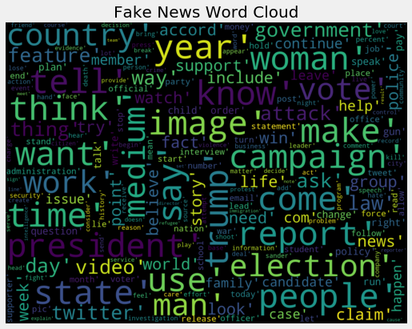
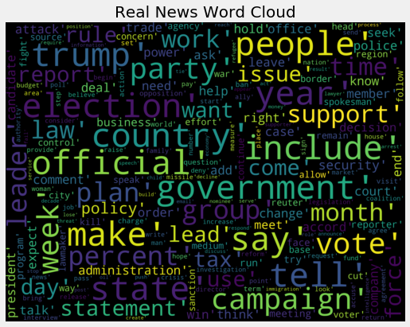
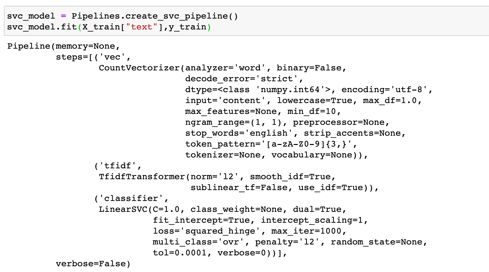

### Fake News Classifier Project

This project is chosen from [Kaggle dataset](https://www.kaggle.com/clmentbisaillon/fake-and-real-news-dataset) to 
classify the news into fake or true news. The challenge here is to create an algorithm to classify if an article is 
fake news or real news.

### Dataset and Inputs:
* Fake.csv - This dataset contains a list of articles considered as "fake" news. Following are the columns and definition:
    * title - The title of the article
    * text - The text of the article
    * subject - The subject of the article
    * date - The date that this article was posted at
    
* True.csv - This dataset contains a list of articles considered as "real" news. Following are the columns and definition:
    * title - The title of the article
    * text - The text of the article
    * subject - The subject of the article
    * date - The date that this article was posted at

### Install
The project requires Python 3.7.6 and the following Python libraries are required to be installed:

* [NumPy](http://www.numpy.org/)
* [Pandas](http://pandas.pydata.org/)
* [matplotlib](https://matplotlib.org/)
* [seaborn](https://seaborn.pydata.org/)
* [wordcloud](https://pypi.org/project/wordcloud/)
* [PIL](https://pypi.org/project/Pillow/2.2.2/)
* [scikit-learn](http://scikit-learn.org/stable/)
* [gensim](https://pypi.org/project/gensim/)
* [textblob](https://textblob.readthedocs.io/en/dev/install.html)
* [spacy](https://spacy.io/usage)
* [statsmodels](https://www.statsmodels.org/stable/install.html)
* [keras](https://pypi.org/project/Keras/)
* [DateTime](https://pypi.org/project/DateTime/)
* [joblib](https://joblib.readthedocs.io/en/latest/installing.html)
* [re](https://pypi.org/project/regex/)

### Code
* preprocess.py - contains the pre-processing steps required to clean text data for exploratory data analysis 
                    referenced in Data_Exploration.ipynb
* Data_Exploration.ipynb - contains the exploratory data analysis to understand the data in-depth
* ml_features.py - contains the feature engineering steps required for machine learning workflow development referenced 
                    in ML_Workflow.ipynb  
* ml_pipelines.py - contains the machine learning pipeline definitions referenced in ML_Workflow.ipynb 
* ML_Workflow.ipynb - contains the machine learning workflow required to develop the machine learning models

### Exploratory Data Analysis 

### Model Pipeline Implementation

### Machine Learning Model Results
| Model | Accuracy |
| --- | --- |
| Benchmark Logistic Regression | 58.64% |
| Multinomial Naive-Bayes | 93.12% |
| Linear SVC | 99% |
| Tuned Multinomial Naive-Bayes | 93.58% |
| Tuned Linear SVC | 99.28% |
| Fully Connected Feed-Forward Model (1-hidden layer – 50 nodes, dropout – 0.02, Adam optimizer) | 87.3% |
| Fully Connected Feed-Forward Model (1-hidden layer – 20 nodes, dropout – 0.02, Adam optimizer) | 88% |