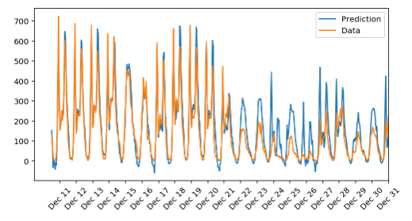

# Deep Learning Projects & Algorithm Implementations

#### This repository contains all the DL (Deep Learning) projects and algorithm implementations.

#### 1. Plagiarism Detector
- Built a plagiarism detector that examines a text file and performs binary classification; labeling that file as either *plagiarized* or *not*, depending on how similar that text file is to a provided source text. Detecting plagiarism is an active area of research; the task is non-trivial and the differences between paraphrased answers and original work are often not so obvious.
- Did data exploration,feature engineering and trained/deployed model on AWS.
- Used AWS SageMaker, Scikit-learn and PyTorch

#### 2. Fake News Classifier
- This project is chosen from [Kaggle dataset](https://www.kaggle.com/clmentbisaillon/fake-and-real-news-dataset) to classify the news into fake or true news. The challenge here is to create an algorithm to classify if an article is fake news or real news.
- Performed exploratory data analysis, feature engineering and built the ML pipeline.
- Results

| Model | Accuracy |
| --- | --- |
| Benchmark Logistic Regression | 58.64% |
| Multinomial Naive-Bayes | 93.12% |
| Linear SVC | 99% |
| Tuned Multinomial Naive-Bayes | 93.58% |
| Tuned Linear SVC | 99.28% |
| Fully Connected Feed-Forward Model (1-hidden layer – 50 nodes, dropout – 0.02, Adam optimizer) | 87.3% |
| Fully Connected Feed-Forward Model (1-hidden layer – 20 nodes, dropout – 0.02, Adam optimizer) | 88% |

#### 3. Predict Bike Sharing Pattern
- Built a neural network from scratch using PyTorch to predict bike sharing patterns.
- The chart below outlines the model prediction.

  

 
